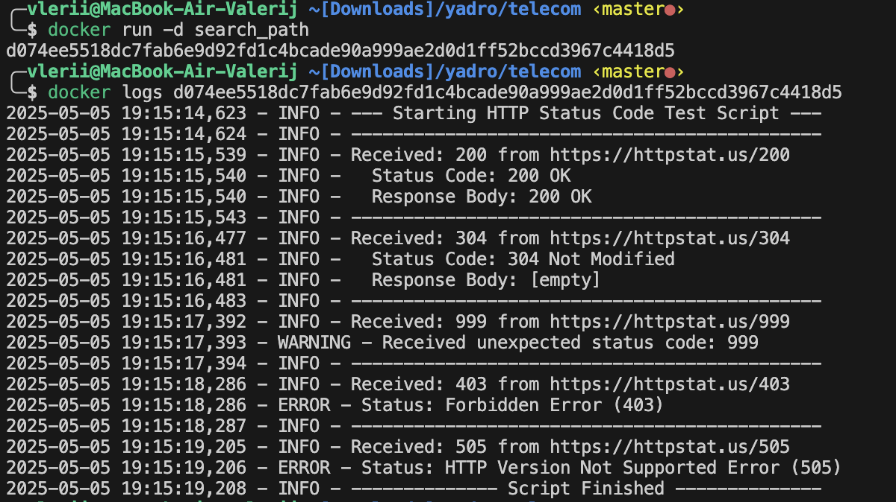

# Отчет по Telecom проекту

Краткий отчет по реализации и инструкции по настройке telecom проекта.

## Задание 1 - Скрипт проверки HTTP статус-кодов
В рамках первого задания реализован Python-скрипт, который отправляет HTTP-запросы к сервису httpstat.us и обрабатывает полученные ответы. Скрипт проверяет различные коды состояния (200, 304, 999, а так же случайные ошибки клиента 4xx и сервера 5xx), логирует результаты и корректно обрабатывает ошибки.

Запуск скрипта:
```zsh
pip install -r 1/requirements.txt
python3 1/main.py
```
### Примечание:
- В реализации скрипта проверки HTTP статус-кодов намеренно было принято решение  обрабатывать ошибки в функции обработки запроса для гарантированного логирования разных типов событий, из-за наличия требования к логированию в задании. Альтернативный вариант с полностью случайным набором кодов и неуспешным выходом, в случае, если попадуться ошибочные коды, был отклонен, так как текущий подход обеспечивает стабильную демонстрацию обработки и логирования как успешных, так и ошибочных ответов при каждом запуске. Хотя, дальнейшие требования из следующих заданий по выводу `exit-code` могут говорить и о предпочтителности такого варианта. 

## Задание 2 - Контейнеризация и логирование
Во втором задании скрипт из Задания 1 был помещен в Docker-контейнер. Был создан Dockerfile на базе Ubuntu 22.04, устанавливающий Python и необходимые зависимости. При запуске контейнера скрипт автоматически выполняется и выводит результаты проверок HTTP-статусов.

Сборка образа и его запуск:
```zsh
cd 2/
docker build -t status_code .
docker run status_code
```

Ниже представлен скриншот запуска команды `docker logs` для контейнера:



## Задание 3 - Ansible Playbook
Был создан Playbook, который развертывает утилиту для проверки HTTP статус-кодов из Задания 2 на хосте через Ansible.

### Структура Playbook
- `site.yml` - основной файл playbook с последовательностью задач
- `inventory.ini` - инвентарный файл с целевыми хостами
- Роли:
  - `install_docker` - отвечает за установку Docker и необходимых зависимостей
  - `deploy_utility` - копирует и запускает нашу утилиту в Docker-контейнере

### Функциональность playbook
- Установка Docker, pipx и необходимых Python-пакетов
- Перенос артефактов из Задания 2 на хосты
- Сборка Docker-образа и запуск контейнера
- Вывод результатов и проверка успешности выполнения утилиты

### Запуск Playbook
```bash
ansible-playbook -i 3/inventory.ini 3/playbook/site.yml 
```

### Примечания
- Playbook настроен для работы с хостом, указанным в inventory.ini. Его работа была протестирована на Ubuntu 24.10, сам playbook предназначен для работы на debian-based репозиториях, на требуется изменить название пакета docker (сейчас -- docker.io).

- Можно было бы использовать snap для большей совместимости с разными дистрибутивами, но однако Docker, установленный через apt работает стабильнее, чем докер из snap.